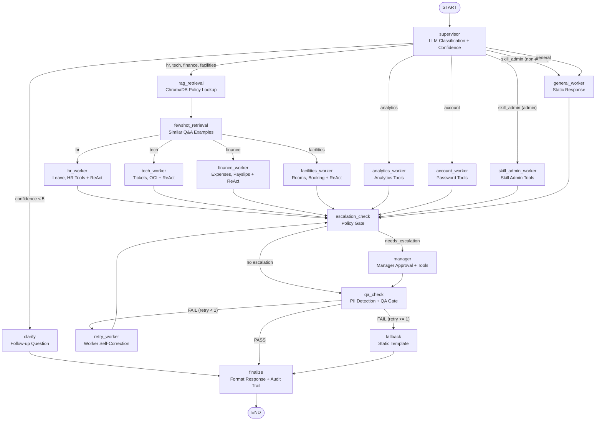

# FrontDesk AI — Self-Evolving Agentic AI Support System

An employee support desk that teaches itself new capabilities through conversation. Admins describe a
capability in plain English; the system researches APIs, writes Python, validates it, installs it to
disk, stores its config encrypted, and exposes it to domain workers — all at runtime, no rebuild.
Skills, LLM provider, and SMTP settings survive restarts.

**Stack:** FastAPI · LangGraph · Ollama Cloud / Groq / OpenRouter / any OpenAI-compatible gateway · SQLite · ChromaDB · OpenTelemetry

## Documentation

| Doc | Use it when you want to… |
|---|---|
| **[participant-instructions.md](participant-instructions.md)** | Deploy it — Codespace, kind, or local; observability; MCP; troubleshooting |
| **[use-case-scenarios.md](use-case-scenarios.md)** | **Experience it** — a guided tour, in order, over the seeded demo data |
| **[user-manual.md](user-manual.md)** | Use it — what to type in chat as an employee or admin |
| **[observability.md](observability.md)** | Read the metrics, spans, logs, and Grafana dashboard |
| **[langfuse-setup.md](langfuse-setup.md)** | Wire up LLM-level tracing with Langfuse |
| **[skills/oci_compute.md](skills/oci_compute.md)** · **[feature/ociconnectivity.md](feature/ociconnectivity.md)** | The shipped OCI skill and its design |

## Quick Start

```bash
git clone https://github.com/brainupgrade-in/aiagentic-comp-frontdeskai.git
cd aiagentic-comp-frontdeskai
cp .env.example .env          # set OLLAMA_API_KEY (primary) and/or GROQ_API_KEY (fallback)

bash scripts/quickstart.sh    # cluster if needed → app → MCP → health check → seed check
```

That is the whole setup. `quickstart.sh` is idempotent, so re-run it any time.

**On a Kubernetes cluster where the platform provides the LLM** (a workshop sandbox with
`APP_NAMESPACE` and `APP_HOST` already exported), there is no `.env` and no vendor key to set:

```bash
bash scripts/deploy-spark.sh   # no arguments — reads your namespace and host from the environment
```

It pulls the published `brainupgrade/frontdeskai` image (amd64 + arm64) and wires the app to the
in-cluster gateway. See `CLAUDE.md` for the constraints that path is built around.

In a **Codespace** you can skip even that: save `OLLAMA_API_KEY` as a Codespaces secret before you create
the codespace, and the devcontainer deploys everything for you — wait for the `FrontDesk AI is ready`
banner.

```bash
# …or run directly against a Python env, no Kubernetes
python3 -m venv .venv && source .venv/bin/activate
pip install -r app/requirements.txt && python app/app.py
```

Open **http://localhost:8000** and log in as `rajesh.kumar@unigps.in` with `brainupgrade`. First login
hashes and stores that password per user; the shared password stops working for them afterwards.

Demo data is pre-seeded (`SEED_DEMO_DATA=true` in `deployment.yaml` and `.env.example`): 10 employees,
leave balances, tickets, expense claims, meeting rooms and payslips — so every scenario has real state to
read and write. Follow **[use-case-scenarios.md](use-case-scenarios.md)** for the guided tour; admin
scenarios need `admin@unigps.in`.

## Architecture

```
User Request → Supervisor (LLM classifier + confidence)
                   │
   ┌───────────────┼──────────────────────────────────────────┐
   │               │                                          │
confidence<5   hr · tech · finance · facilities    analytics · account · skill_admin · general
   │               │                                          │
Clarify      RAG Retrieval → Few-shot Retrieval               │
   │               └──────────────► Domain Worker ◄───────────┘
   │                                     ↓
   │                             Escalation Check
   │                             ├→ Manager (policy exceptions) → QA Check
   │                             ├→ QA Check (PII redaction)
   │                             └→ Fallback (template)
   │                                     ↓
   │                       QA pass → Finalize
   │                       QA fail → Retry Worker (once) → Escalation Check
   └────────────────────────────────────► Finalize
```

18 graph nodes. Only `hr`, `tech`, `finance`, and `facilities` pass through RAG and few-shot retrieval;
`analytics`, `account`, `skill_admin`, and `general` route straight to their worker. `skill_admin` is
admin-gated — non-admins are redirected to `general`.

**Features:** structured LLM routing with low-confidence clarification · RAG over policy docs (ChromaDB,
ONNX embeddings — no torch) · few-shot memory grown from 👍 feedback · ReAct tool loop (3 iterations) · QA
gate with PII redaction and one self-correction retry · identity and approval authority resolved from the
session and the employees table, never from the prompt · runtime skill install with encrypted per-skill
config · chat-configurable LLM provider, fallback, and SMTP · analytics by chat or dashboard · knowledge
base upload.

```
app/
  app.py            FastAPI — login, chat, KB management, analytics API, admin gates
  agents.py         LangGraph StateGraph + dynamic LLM factory
  auth.py           PBKDF2 password hashing, ContextVar identity
  tools.py          Domain tools per category (incl. the MCP leave client)
  skills.py         Dynamic skill registry, admin tools, skill_config()
  rag.py            ChromaDB indexing/retrieval of data/policies/*.md
  fewshot.py        Few-shot Q&A memory
  observability.py  OTel metrics, tracing, JSON logging
skills/             Skill source kept in git (copied to the PVC to install)
mcp/                MCP Leave Service — PostgreSQL manifests + FastMCP server
scripts/            deploy.sh, deploy-mcp.sh, manifests/, observability/
```

## Dynamic Skills — The Self-Teaching Engine

```
Admin: "Install a weather lookup skill"
  1. RESEARCH   search_web → fetch_webpage → reads API docs
  2. WRITE      LLM generates a Python skill file
  3. VALIDATE   AST parse, check SKILL_META + @tool decorators
  4. PERSIST    /shared/.frontdeskai/skills/weather.py
  5. LOAD       import, register tools immediately

Admin: "Set the API key for weather skill to sk-..."
  6. CONFIGURE  encrypted into the system_config table

Employee: "What's the weather in Mumbai?"
  7. EXECUTE    facilities worker gets the tool injected, reads config, calls the API
```

A skill is a standalone Python file: a `SKILL_META` dict (`name`, `description`, `categories` — which
domain workers receive the tool — and `config_keys`), plus `@tool` functions that read their config via
`skill_config(skill_name, key)`. See `skills/oci_compute.py` for a complete example.

**Skill admin tools:** `search_web`, `fetch_webpage`, `install_skill`, `list_skills`, `set_skill_config`,
`get_skill_config`, `get_llm_config`, `change_llm_model`, `configure_fallback_llm`, `configure_smtp`,
`get_smtp_config`, `send_email`. For the phrasing that triggers each, see [user-manual.md](user-manual.md).

**Shipped skill — `oci_compute`:** OCI compute self-service for the `tech` and `skill_admin` workers
(list, inspect, softreset/stop/start, launch, terminate). Launch and terminate are admin-gated. All OCI
credentials, including the API private key, are set through admin chat and stored encrypted — no
Kubernetes Secret or `~/.oci/config` mount. Install:

```bash
kubectl cp skills/oci_compute.py \
  $(kubectl get pod -l app=frontdeskai -o jsonpath='{.items[0].metadata.name}'):/shared/.frontdeskai/skills/oci_compute.py
kubectl rollout restart deployment/frontdeskai
```

## MCP Demo — Employee Leave via Remote PostgreSQL

Shows an LLM agent reaching an HR system through the Model Context Protocol rather than a local DB.

```
default namespace                     postgres namespace
─────────────────                     ──────────────────
FrontDesk AI                          MCP Leave Server (:8001)
  HR Worker                 MCP/HTTP        ↓ psycopg2
  get_leave_balance_from_hr_system ──→  PostgreSQL (:5432)
  (urllib JSON-RPC POST)                public schema
```

`bash scripts/deploy-mcp.sh` deploys PostgreSQL + the server and runs a smoke test (`quickstart.sh` does
this for you). Then ask *"How many leaves do I have left?"* — the HR worker POSTs a JSON-RPC call to
`http://mcp-leave.postgres.svc.cluster.local:8001/mcp`. Transport is `streamable-http` (stateless): one
POST carries the call and returns an SSE-formatted response, no session handshake. Full diagram:
[`mcp/mcp-postgre/design.html`](mcp/mcp-postgre/design.html).

It writes as well as reads: `approve_leave` records an approved request and deducts the days atomically,
and the escalation **manager** node calls it through `approve_leave_via_mcp`, so a leave request over the
policy limit is settled by a write into that remote database. Employee ids the server has not seen are
auto-provisioned with the default entitlement (12 casual / 6 sick / 15 earned / 24 WFH), which is why an
app employee's balance comes from PostgreSQL rather than the app's own SQLite seed.

## Configuration

Everything below is also changeable at runtime through admin chat (stored in `system_config`, persists
across restarts): LLM model/provider/API key, fallback LLM, SMTP settings, per-skill config. See
[user-manual.md](user-manual.md) for the phrasing.

| Variable | Description | Default |
|----------|-------------|---------|
| `OLLAMA_API_KEY` | Ollama Cloud key — primary LLM (`api.ollama.com`) | (required) |
| `GROQ_API_KEY` | Groq key — fallback LLM | (recommended) |
| `OPENROUTER_API_KEY` | OpenRouter key, if switching provider | — |
| `SECRET_KEY` | JWT signing + encryption key derivation | Auto-generated (set it in production) |
| `AUTH_PASSWORD` | Shared password for first-time login | `brainupgrade` |
| `ADMIN_EMAILS` | Comma-separated admin emails | `admin@unigps.in` |
| `SQLITE_DIR` | SQLite directory | `/shared/.sqlite` |
| `CHROMA_DIR` | ChromaDB directory | `/shared/chromadb` |
| `SEED_DEMO_DATA` | Pre-populate demo employees, tickets, expenses, leave, rooms, payslips | `false` (`deployment.yaml` sets `true`) |
| `MCP_LEAVE_URL` | MCP Leave Server endpoint | `http://mcp-leave.postgres.svc.cluster.local:8001/mcp` |
| `LANGFUSE_PUBLIC_KEY` / `LANGFUSE_SECRET_KEY` / `LANGFUSE_HOST` | Langfuse tracing (optional) | — |

**LLM providers:** Ollama Cloud (`gemma4:cloud`, `qwen3-next:80b`, `deepseek-v3.1:671b`, …), Groq
(`llama-3.3-70b-versatile`, `llama-3.1-8b-instant`, …), OpenRouter (100+ models as `provider/model`). If
the primary errors, the configured fallback is used automatically.

## Storage

| Store | Location | Contents |
|---|---|---|
| `history.db` | `$SQLITE_DIR` | Chat history + `users` (per-user password hashes) |
| `frontdesk_tools.db` | `$SQLITE_DIR` | Employees, leave, tickets, expenses, rooms, payslips + `system_config` |
| `checkpoints.db` | `$SQLITE_DIR` | LangGraph checkpointer |
| ChromaDB | `$CHROMA_DIR` | RAG policy chunks + few-shot examples |
| Skills | `/shared/.frontdeskai/skills/` | Dynamic skill `.py` files, auto-loaded at startup |

## Observability

Prometheus metrics at `/metrics` (port 8000): `frontdeskai_llm_call_duration_seconds`,
`frontdeskai_llm_tokens_total`, `frontdeskai_category_total`, `frontdeskai_escalations_total`,
`frontdeskai_fallbacks_total`, `frontdeskai_agent_errors_total`, `frontdeskai_request_duration_seconds`.
Structured JSON logs to stdout (Promtail → Loki) and OTLP spans to Tempo, correlated by `trace_id` —
`chat.send` wraps the request, `llm.<agent>` wraps each LLM call. Span attributes, PromQL/LogQL examples,
dashboard panels and known pitfalls: **[observability.md](observability.md)**. Prompt/completion/cost
tracing: **[langfuse-setup.md](langfuse-setup.md)**.

## Security

- Per-user PBKDF2-HMAC-SHA256 hashing (600k iterations, 32-byte salt), OWASP 2024 compliant
- JWT in `httponly` + `samesite=strict` cookies, 24h expiry
- Security headers (CSP, X-Frame-Options DENY, nosniff, referrer policy); input validation and path
  traversal protection
- Prompt injection guardrails — delimiter-wrapped user input, PII detection/redaction in the QA gate
- Admin access gated by `ADMIN_EMAILS`; tool identity comes from a server-set `ContextVar` the LLM
  cannot influence — no tool accepts an `employee_id`, `approver_id` or `booked_by` argument, including
  the remote MCP leave tools, so neither reads nor writes can be redirected to another employee
- Approval authority is a separate check against the `employees` table: an expense claim can only be
  decided by the claimant's manager or a senior finance approver, and never by the claimant
- SMTP password and secret skill config encrypted at rest with Fernet, key derived from `SECRET_KEY`
  (rotating it requires re-running `configure_smtp`)

## Access

The kind cluster uses `extraPortMappings`, so NodePort services bind directly to `localhost` — no
`kubectl port-forward`.

| Service | URL | NodePort |
|---------|-----|----------|
| FrontDesk AI | http://localhost:8000 | 30800 |
| Grafana | http://localhost:3000 (agenticai / agentgrow.io) | 30300 |
| Metrics | http://localhost:9090/metrics | 30900 |

Prometheus and Tempo have no NodePort:

```bash
kubectl -n monitoring port-forward svc/kube-prometheus-stack-prometheus 9091:9090
```

## Complete Workflow Diagram


